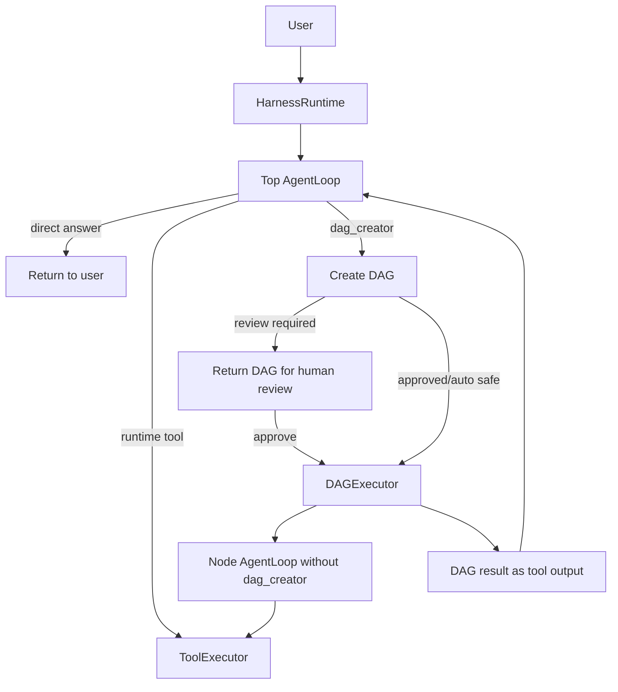

# dagent Handoff

This file is for continuing work from another Codex session or machine.

## Repository

- GitHub: https://github.com/RobotSe7en/dagent.git
- Local project root expected by current work: `dagent/`
- Main branch: `main`
- Latest known commit when this handoff was written: `b751ea8 Remove legacy runtime packages`

If GitHub access is unstable, use the local Clash proxy:

```powershell
git -c http.proxy=http://127.0.0.1:7890 -c https.proxy=http://127.0.0.1:7890 push
```

## Current Architecture

The project has been refactored to use a single core runtime package:

```text
dagent/
  api/              FastAPI API
  harness_runtime/  core runtime, agent loop, DAG creation/execution/review/trace
  providers/        OpenAI-compatible and mock providers
  schemas/          DAG, node, edge, trace, feedback schemas
  state/            prompt assembly
  tools/            registry, executor, file tools, boundaries
profiles/           editable agent profiles
web/                React/Vite UI
tests/              pytest suite
```

Legacy `dagent/harness/` and `dagent/runtime/` directories were removed. Use imports from `dagent.harness_runtime`.

Important files:

- `dagent/harness_runtime/runtime.py`
  - `HarnessRuntime`
  - top-level conversation-first entrypoint
  - runs the top AgentLoop and handles `dag_creator`
- `dagent/harness_runtime/agent_loop.py`
  - single-agent loop primitive
  - supports runtime tools and optional control tools
- `dagent/harness_runtime/control_tools.py`
  - `dag_creator` tool schema
- `dagent/harness_runtime/dag_creator.py`
  - DAG creator implementation
  - still exports `DagCreator`, `MockDagCreator`, `LLMDagCreator`
- `dagent/harness_runtime/dag_executor.py`
  - executes approved DAGs using node AgentLoops without `dag_creator`
- `dagent/api/app.py`
  - FastAPI app
  - `/messages/stream` is the default conversation-first API
  - `/tasks/stream` remains as a force-DAG compatibility path
- `web/src/App.tsx`
  - WebUI with `Auto | Direct | DAG` modes
- `web/src/api.ts`
  - frontend API client

## Runtime Flow

The intended architecture is:



Modes:

- `auto`: top AgentLoop may call `dag_creator` when the task needs complex DAG orchestration.
- `direct`: top AgentLoop cannot call `dag_creator`; no DAG should be created.
- `dag_creator`: bypasses conversation and invokes DAG creation directly.

## Model Configuration

Config is in `config.yaml`.

Current provider:

```yaml
provider:
  base_url: "https://api.minimaxi.com/v1"
  model: "MiniMax-M2.1"
  api_key_env: "MINIMAX_API_KEY"
```

The key lives in `.env` as `MINIMAX_API_KEY=...`; `.env` is ignored by git.

Do not commit secrets.

## Profiles

Profiles are Markdown/YAML based and live in `profiles/`.

Currently important:

- `profiles/conversation/`
  - top-level conversation agent
  - tells the model to answer directly for simple conversations/simple tools/short serial tasks
  - only use `dag_creator` for complex orchestration
- `profiles/dag_creator/`
  - used by `LLMDagCreator` in `dag_creator.py`
- `profiles/dag_reviewer/`
- `profiles/feedback_learner/`

## API

Start backend:

```powershell
uv run uvicorn dagent.api.app:app --host 127.0.0.1 --port 8001
```

Health:

```powershell
Invoke-WebRequest http://127.0.0.1:8001/health -UseBasicParsing
```

Conversation-first stream:

```powershell
$body = @{ message = "你好"; mode = "auto" } | ConvertTo-Json
Invoke-WebRequest -Uri http://127.0.0.1:8001/messages/stream -Method Post -ContentType "application/json" -Body $body -UseBasicParsing
```

Expected for simple greetings: direct answer and `"dag": null`.

## WebUI

Frontend is in `web/`.

Install/build:

```powershell
cd web
npm install
npm run build
```

Dev server:

```powershell
$env:VITE_API_TARGET="http://127.0.0.1:8001"
npm run dev
```

Open:

```text
http://127.0.0.1:5173
```

The WebUI has `Auto | Direct | DAG` mode buttons.

## Verification

Run Python tests:

```powershell
uv run --extra dev pytest
```

Expected at this handoff:

```text
42 passed, 2 skipped
```

Run frontend build:

```powershell
cd web
npm run build
```

## Current Git State At Handoff

The latest pushed work includes:

- `47071e7 Add conversation-first harness runtime`
- `8effa4d Merge runtime modules into harness_runtime`
- `b751ea8 Remove legacy runtime packages`

Before continuing:

```powershell
git pull
git status --branch --short
```

## Suggested Next Work

High-value next steps:

- Improve `dag_creator` return/resume behavior after user approves a review-required DAG, so DAG result can be injected back into top AgentLoop and summarized automatically.
- Add persistent session/run storage instead of current in-memory API state.
- Add trace events for top AgentLoop tool calls, not only DAG executor traces.
- Improve WebUI display for direct conversation traces and `dag_creator` control events.
- Add API tests for `dag_creator` mode and runtime-created DAG approve/execute flow.

## Notes For Future Codex

- Use `apply_patch` for code edits.
- Prefer `uv run --extra dev pytest` and `npm run build` before committing.
- Do not reintroduce `dagent/harness/` or `dagent/runtime/`; the core package is `dagent/harness_runtime/`.
- The class names `LLMDagCreator`, `MockDagCreator`, and `DagCreator` are currently retained for compatibility even though the file is now `dag_creator.py`.
