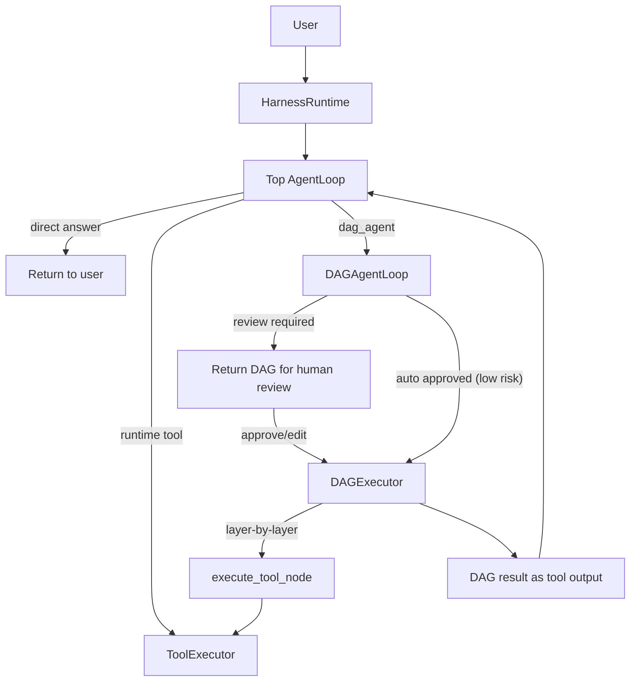

# dagent Handoff

This file is for continuing work from another session or machine.

## Repository

- GitHub: https://github.com/RobotSe7en/dagent.git
- Main branch: `main`
- Current branch: `claude/friendly-bhaskara-959f3b`
- Base branch: `main`
- Latest commit: `11bca7c Rename control_tools.py to auto_mode_tools.py for clarity`

If GitHub access is unstable, use the local Clash proxy:

```powershell
git -c http.proxy=http://127.0.0.1:7890 -c https.proxy=http://127.0.0.1:7890 push
```

## Architecture

```text
dagent/
  api/              FastAPI API (SSE streaming)
  harness_runtime/  core runtime, agent loop, DAG creation/execution/review/trace
  providers/        OpenAI-compatible and mock providers
  schemas/          DAG, node, edge, trace schemas
  state/            prompt assembly (PromptBuilder)
  tools/            registry, executor, file tools, boundary enforcement
profiles/           editable agent profiles (Markdown/YAML)
web/                React + Vite + Tailwind frontend
tests/              pytest suite
```

Key imports: use `dagent.harness_runtime`, not legacy `dagent/harness/` or `dagent/runtime/`.

### Core Files

| File | Responsibility |
|------|----------------|
| `dagent/harness_runtime/runtime.py` | `HarnessRuntime` - top-level auto/direct/dag router and user-facing summarizer |
| `dagent/harness_runtime/agent_loop.py` | Single-agent loop primitive with runtime/control tools |
| `dagent/harness_runtime/dag_agent.py` | `DAGAgentLoop` - owns DAG messages, initial planning, review checkpoints, layer execution, observation, and replanning |
| `dagent/harness_runtime/dag_executor.py` | `DAGExecutor` - layer-by-layer DAG execution with placeholder injection |
| `dagent/harness_runtime/dag_validation.py` | Structural DAG validation (acyclic, no isolated nodes, tool required) |
| `dagent/harness_runtime/review_policy.py` | `ReviewPolicy` (`fast`/`careful`) + `effective_risk()` |
| `dagent/harness_runtime/trace_store.py` | Immutable trace storage for completed node records |
| `dagent/harness_runtime/auto_mode_tools.py` | `dag_agent` tool schema for top AgentLoop (auto mode routing) |
| `dagent/schemas/node.py` | `DAGNode` (6 fields: id, tool, args, boundary, risk, status) and `Boundary` |
| `dagent/schemas/dag.py` | `DAG`, `PlanSpec`, `PlanNodeSpec` |
| `dagent/tools/registry.py` | `ToolRegistry` with `all_tools()`, Tool has `boundary_fn`/`risk_fn` callbacks |
| `dagent/tools/boundary.py` | Boundary enforcement (path, command, action checks) |
| `dagent/api/app.py` | FastAPI app - `/messages/stream`, `/messages/resume`, `/tasks/{id}/trace` |
| `web/src/App.tsx` | WebUI with Auto/Direct/DAG modes, DAG review dialog |
| `profiles/dag_agent/agent.md` | DAG agent system prompt |

## DAGNode Schema (Current)

Every DAG node is a deterministic tool call - no agent nodes, no goals:

```python
class DAGNode(BaseModel):
    id: str
    tool: str | None = None
    args: dict[str, Any] = Field(default_factory=dict)
    boundary: Boundary = Field(default_factory=Boundary)
    risk: RiskLevel = "low"           # low | medium | high
    status: NodeStatus = "planned"    # planned | ready | running | completed | failed | skipped

class Boundary(BaseModel):
    mode: BoundaryMode = "read_only"  # read_only | write_limited | full
    allowed_paths: list[str] = []
    allowed_commands: list[str] = []
```

Removed fields (do NOT reintroduce): `risk_reason`, `title`, `goal`, `kind`, `agent`, `tools`, `skills`, `expected_output`, `max_steps`, `timeout_seconds`, `forbidden_tools`, `forbidden_commands`.

## Runtime Flow


```mermaid
flowchart TD
  U["User"] --> R["HarnessRuntime"]
  R --> A["Top AgentLoop"]

  A -->|"direct answer"| O["Return to user"]
  A -->|"runtime tool"| T["ToolExecutor"]
  A -->|"dag_agent"| D["DAGAgentLoop"]

  D -->|"review required"| UI["Return DAG for human review"]
  D -->|"auto approved (low risk)"| E["DAGExecutor"]

  UI -->|"approve/edit"| E

  E -->|"layer-by-layer"| N["execute_tool_node"]
  N --> T

  E --> DR["DAG result as tool output"]
  DR --> A
```

Modes:

- `auto`: top AgentLoop may call `dag_agent` when the task needs orchestration.
- `direct`: top AgentLoop cannot call `dag_agent`; no DAG created.
- `dag`: bypasses tool choice, invokes DAG planning directly.

### Key Design Decisions

- **Tool-node-only DAG**: every node is a direct tool call. Intelligence lives in the replanner, not in node agents.
- **Placeholder injection (Level 1 replanning)**: `{{node_id.output}}` in args gets replaced with actual output. Happens automatically in `_execute_next_ready_layer`.
- **Unified replanning (Level 2+3)**: after each layer executes (success or failure), `_replan_after_layer` uses the internal DAG model-call path with formatted replan data. The LLM decides: NO_CHANGE (skip), adjust parameters (L2), or restructure the remaining subgraph (L3). On failure, replan is mandatory; on success, NO_CHANGE skips revision. Replan instructions are in `profiles/dag_agent/agent.md`.
- **DAG agent session memory**: `dag_messages` (a `[user, assistant, ...]` list) persists across the entire plan �execute �replan lifecycle. Seeded with conversation history at `DAGAgentLoop.run()` time, then each internal DAG model call appends its prompt and response. This gives the LLM full context of its prior planning decisions during replanning, without needing a separate AgentLoop.
- **dag_start auto-complete**: synthetic start nodes (`tool="dag_start"`) are auto-completed in `execute_node` without calling ToolExecutor.
- **Dynamic tool injection**: `HarnessRuntime.__init__` injects `dag_executor.tool_executor.registry.all_tools()` into `dag_agent.tools`, which `PromptBuilder` renders as `## Available Tools` in the prompt.
- **Boundary enforcement**: whitelist approach - `allowed_paths` and `allowed_commands` constrain what each node can access.
- **Risk/boundary separation**: risk = "need approval?" (pre-execution), boundary = "allowed to execute?" (runtime constraint). `effective_risk(tool, args)` in `review_policy.py` is the single source of truth.
- **Tool-owned inference**: `boundary_fn` and `risk_fn` callbacks on Tool registration move domain logic (e.g. command whitelist) out of dag_agent.py into tool definitions (e.g. `command_tools.py`).

## Available Tools (registered in ToolRegistry)

| Tool | Action | Description |
|------|--------|-------------|
| `dag_start` | read | No-op start marker for connecting root nodes |
| `read_file` | read | Read a UTF-8 text file |
| `write_file` | write | Write UTF-8 text to a file |
| `grep` | read | Search files for a regex pattern |
| `run_command` | read/write | Run a shell command with boundary checks; has `boundary_fn` + `risk_fn` (whitelist→low, else→high) |

Tools are dynamically injected into the DAG agent prompt. Do NOT hardcode tool names in profile files.

### Risk & Boundary Architecture

```
effective_risk(tool, args)          # in review_policy.py
  ├── tool.risk_fn(args)            # dynamic (e.g. run_command checks whitelist)
  └── tool.risk                     # static fallback

_infer_boundary(tool, args)         # in dag_agent.py, at planning time
  ├── tool.boundary_fn(args)        # custom (e.g. run_command infers mode/paths/commands)
  └── tool.action + tool.path_args  # generic fallback

ReviewPolicy (2 levels)             # in review_policy.py
  fast     -> do not pause for DAG changes
  careful  -> pause when a DAG is created or changed
```

All three modes (auto/direct/dag) go through `ToolExecutor.execute()` which enforces boundary constraints.

## Model Configuration

Config in `config.yaml`:

```yaml
provider:
  base_url: "https://api.minimaxi.com/v1"
  model: "MiniMax-M2.1"
  api_key_env: "MINIMAX_API_KEY"
```

Key lives in `.env` as `MINIMAX_API_KEY=...`; `.env` is gitignored. Do not commit secrets.

## Running

Backend:

```powershell
uv run uvicorn dagent.api.app:app --host 127.0.0.1 --port 8001
```

Frontend dev:

```powershell
cd web
npm install
$env:VITE_API_TARGET="http://127.0.0.1:8001"
npm run dev
# Open http://127.0.0.1:5173
```

Tests:

```powershell
uv run --extra dev pytest
# Expected: 107 passed, 2 skipped
```

Frontend type check:

```powershell
cd web
npx tsc --noEmit
```

## Recent Changes (this branch)

1. **Unified risk computation**: Single `effective_risk(tool, args)` in `review_policy.py` replaces scattered risk inference. Supports static `tool.risk` and dynamic `tool.risk_fn(args)` callbacks.
2. **Tool-owned boundary/risk inference**: `boundary_fn` and `risk_fn` on Tool registration. `run_command` uses command whitelist (read-only commands→low risk, others→high). No more hardcoded tool names in `dag_agent.py`.
3. **Dead code cleanup**: Removed `apply_risk_overrides`, `_required_risk_for_node`, `_risk_rank`, `_max_risk`, `_record_tool_trace` from `dag_executor.py`. Removed `_infer_risk`, `_max_risk_str`, `_RISK_RANK` from `dag_agent.py`. Removed unused `task` param from `_compile_plan_node`.
4. **LLM no longer proposes risk**: Removed `risk` field from `PlanNodeSpec`. Risk is computed server-side via `effective_risk()`.
5. **Renamed `control_tools.py` �`auto_mode_tools.py`** for clarity.
6. **DSL-only DAG creation**: Removed the legacy full-DAG compatibility path and updated tests to feed PlanSpec DSL fixtures.
7. **DAG agent session memory (`dag_messages`)**: Single `[user, assistant, ...]` message list on `TaskRecord`, seeded from conversation history at `DAGAgentLoop.run()` time. Each internal DAG model call appends its prompt and response. Removed `conversation_messages` parameter entirely �all context flows through `dag_messages`.
8. **Complete DSL replan**: Replan always returns a complete PlanSpec DSL including both completed and pending nodes. Removed `_merge_completed_nodes` and all partial DSL merge logic from `runtime.py`.
9. **Simplified review modes**: `fast` runs DAG creation/replans without human checkpoints; `careful` pauses only when the DAG is created or changed. Execution failures and boundary violations feed back into LLM replanning instead of creating separate human review or permission gates.
10. **DAGAgentLoop consolidation**: Removed public `LLMDAGAgent`/`DAGAgent` and `aplan()` APIs. DAG creation, validation retries, execution, and replanning now live behind `DAGAgentLoop.run()` / `resume()` / `execute()`. `HarnessRuntime` only routes modes and summarizes DAG results.
11. **Event-style DAG observations**: Removed separate `_dag_planning_prompt` and `_replan_user_message` prompt builders. DAGAgentLoop now feeds history plus `_format_dag_observation()` messages for planning context, validation feedback, successful layers, and failed layers; `agent.md` remains the source of planning/replanning rules.


### Earlier changes (merged from `codex/llm-facing-planspec-dsl`):

10. **LLM-facing PlanSpec DSL**: DAGAgent consumes compact DSL output and parses it into PlanSpec/DAG.
11. **DAG conversation context**: forced DAG mode, auto dag_agent creation, continuation DAGs, and failure replanning now pass recent user/assistant history plus structured DAG execution context.
12. **Unknown tool feedback**: DAG validation checks node tools against the runtime registry and feeds unknown-tool errors back to DAGAgent for replanning.
13. **Execution recovery fixes**: failed parallel layers preserve successful sibling results, stale failed trace node ids are ignored after replanning, and failed DAG mode no longer loops through repeated approvals.
14. **Command failure semantics**: `run_command` now raises `ToolExecutionError` on non-zero exit codes, so DAG traces show `tool_failed`/`node_failed` instead of `tool_completed`.
15. **WebUI DAG fixes**: completed/failed DAG cards are no longer confirmable, and final assistant output is appended correctly after DAG review/execution.
16. **File tool safety**: `grep` skips heavy generated directories and caps large result sets.

## Three-Level Replan Status

| Level | Description | Status |
|-------|-------------|--------|
| 1 - Placeholder Injection | `{{node_id.output}}` in args replaced with upstream output | �Implemented (`_inject_placeholders` in `dag_executor.py`) |
| 2+3 - Unified Replan | LLM decides: no change, adjust params, or restructure subgraph | �Implemented (`DAGAgentLoop._replan_after_layer` in `dag_agent.py`) |

After each layer executes, L1 placeholder injection runs first (code, no LLM). Then
`_replan_after_layer` formats replan data and uses the internal DAG model-call path �the same
method used for initial planning. `dag_from_model_output` returns `None` for `NO_CHANGE`.
The LLM returns `NO_CHANGE` (no replan needed), adjusted PlanSpec DSL (param tweaks), or
a restructured PlanSpec DSL (new/removed/reordered nodes). On the error path, replan is
mandatory (NO_CHANGE raises). Replan instructions are in `profiles/dag_agent/agent.md`.

DAG agent session memory: `dag_messages` on `TaskRecord` is a single `[user, assistant, ...]`
list seeded with conversation history at `DAGAgentLoop.run()` time. Each internal DAG model call appends its
prompt and response. The LLM sees: conversation history �initial planning exchange �
layer result �replan response �next layer result �... as one continuous conversation.
There is no public `aplan()` planner API; all context flows through `dag_messages`.

## Suggested Next Work
- Add `list_files` / `list_directory` as a proper registered tool (currently uses `run_command` + `dir`)
- Add persistent session/run storage (currently in-memory)
- Improve trace events for top AgentLoop tool calls
- Add WebUI node execution status indicators (running/completed/failed coloring)
- Install `gh` CLI for PR automation (`winget install GitHub.cli`)

## Notes

- Use `uv run --extra dev pytest` and `npx tsc --noEmit` before committing.
- Do not reintroduce `dagent/harness/` or `dagent/runtime/`.
- Canonical class names: `DAGAgentLoop`, `HarnessRuntime`, `DAGExecutor`.
- `PlanNodeSpec` fields: `id`, `tool`, `args`, `depends_on`. No `goal`, no `risk` (risk is computed server-side).
