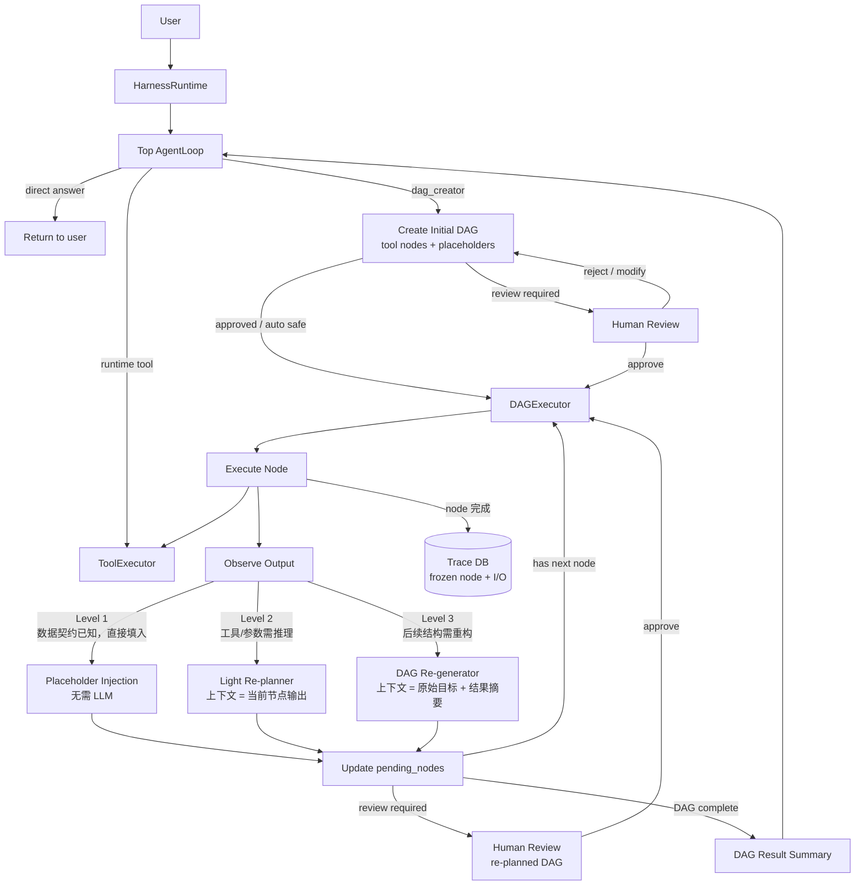

# dagent

A private-deployable, human-reviewed Agent DAG framework.

`dagent` turns user requests into reviewable DAGs, lets a human approve risky
plans, then executes each DAG node through tool calls with dynamic re-planning,
trace events, and OpenAI-compatible model access.

## Current Status

Implemented milestones:

- **Milestone 1**: Pydantic schemas, mock DAG creator, DAG validation
- **Milestone 2**: tool registry, file tools, boundary enforcement
- **Milestone 3**: OpenAI-compatible provider, mock provider, bounded agent loop
- **Milestone 4**: DAG executor, topo scheduling, risk override, trace recording

Also implemented:

- LLM-backed DAG creator (`LLMDagCreator`) using the configured OpenAI-compatible model
- Harness control plane (`ControlPlane`) for plan -> validate -> review status -> approve -> execute
- Default factory (`create_control_plane`) that wires MiniMax/OpenAI-compatible provider,
  tool executor, agent loop, DAG creator, DAG executor, and trace recorder
- Harness runtime (`HarnessRuntime`) as the new conversation-first entrypoint:
  top-level AgentLoop can answer directly, use runtime tools, or call `dag_creator`
  when complex DAG orchestration is warranted
- FastAPI control plane for task creation, DAG editing, approval, execution, and trace retrieval
- React WebUI connected to the real API with markdown chat, DAG review/editing, and trace display

Not implemented yet:

- persistent storage
- feedback learner

## Project Layout

```text
dagent/
  api/          FastAPI app exposing task, DAG, run, and trace endpoints
  harness_runtime/
                conversation-first runtime, AgentLoop, DAG planning/execution,
                review agents, trace recording, and dag_creator control tool
  providers/    OpenAI-compatible and mock chat providers
  schemas/      DAG, node, edge, trace, feedback models
  tools/        tool registry, executor, file tools, boundary checks
  state/        prompt assembly and future context/memory/session state
profiles/       editable agent profiles for DAG creator/reviewer/feedback agents
tests/          pytest suite
```

## Configuration

Model settings live in `config.yaml`.

```yaml
provider:
  base_url: "https://api.minimaxi.com/v1"
  model: "MiniMax-M2.1"
  api_key_env: "MINIMAX_API_KEY"
  timeout_seconds: 60
  strip_thinking: false
profiles:
  directory: "profiles"
  dag_creator: "dag_creator"
  dag_reviewer: "dag_reviewer"
  feedback_learner: "feedback_learner"
```

Secrets should live in `.env`, which is ignored by git:

```env
MINIMAX_API_KEY=your-api-key
```

You can point to another config file with:

```powershell
$env:DAGENT_CONFIG="C:\path\to\config.yaml"
```

## Agent Profiles

DAG creator, DAG reviewer, and feedback learner prompts live in editable profile
directories under `profiles/`.

```text
profiles/
  dag_creator/
    profile.yaml
    soul.md
    guideline.md
    agent.md
    memory.md
  dag_reviewer/
    profile.yaml
    soul.md
    guideline.md
    agent.md
    memory.md
  feedback_learner/
    profile.yaml
    soul.md
    guideline.md
    agent.md
    memory.md
  conversation/
    profile.yaml
    soul.md
    guideline.md
    agent.md
    memory.md
```

`profile.yaml` contains structured metadata and the ordered prompt layers:

```yaml
name: dag_creator
role: dag_creator
description: Generates reviewable DAGs from user requests.
layers:
  - soul.md
  - guideline.md
  - agent.md
memory_file: memory.md
output_format: json
```

Stable profile behavior lives in Markdown:

- `soul.md`: identity and role
- `guideline.md`: durable behavior rules
- `agent.md`: role-specific task contract, including output format
- `memory.md`: profile-specific learning notes

Dynamic sections are not stored in profile files:

- tools are generated from `tools.registry`
- skills should come from the future `skills/` loader
- user/task prompts are generated by `state.prompt_builder`
- DAG, trace, feedback, and node context are injected at runtime

The current `LLMDagCreator` DAG creator loads `profiles/dag_creator/`. The profile store is
filesystem-backed by design so a future WebUI can list, edit, validate, reorder,
and save profile layers without touching Python code.

Implemented profile-backed roles:

- `HarnessRuntime` top-level conversation agent
- `LLMDagCreator` DAG creator
- `DAGReviewerAgent`
- `FeedbackLearnerAgent`

## Harness Runtime Flow

The default WebUI/API path is conversation-first. DAG is a control tool,
not the default response shape.



Runtime modes:

- `auto`: top AgentLoop may call `dag_creator` only when useful.
- `direct`: top AgentLoop cannot call `dag_creator`.
- `dag_creator`: bypasses conversation and invokes the DAG creator directly.

## Dynamic DAG Execution

DAG nodes are **tool nodes** — deterministic tool calls, not nested agent loops.
Intelligence lives in the re-planner, not inside each node. After every node
completes, the DAGExecutor decides how to proceed via a three-level strategy:

### Re-planning Levels

| Level | Trigger | Context passed to LLM | LLM call |
|-------|---------|----------------------|----------|
| **1 — Placeholder Injection** | Data contract known at DAG creation time; only values are unknown | Direct predecessor node output only | None — pure string substitution |
| **2 — Light Re-planner** | Tool type or parameters require runtime reasoning | Current node output + next node definition | Lightweight |
| **3 — DAG Re-generator** | Downstream structure must change | Original goal + per-node result summaries | Full re-plan |

Key design principles:

- **Context is minimal by design.** Each level receives only the information
  needed to make its decision. Completed nodes are stored in Trace DB and never
  re-injected into the LLM context.
- **Frozen nodes are immutable.** Once a node completes and is written to Trace
  DB, it cannot be modified by any re-planner. This preserves audit integrity.
- **Re-planning is incremental.** Level 3 re-generates only the pending subgraph,
  not the entire DAG. Completed nodes are preserved as-is.
- **DAG structure vs. parameter values.** When downstream node count or topology
  depends on a runtime result, the task should remain in the Top AgentLoop as
  sequential tool calls rather than being forced into a static DAG.

### When to Use DAG vs. Agent Loop

| Task shape | Recommended path |
|------------|-----------------|
| Independent subtasks that can run in parallel | DAG |
| Sequential steps with known structure, runtime values only | DAG + placeholder injection |
| Exploratory steps where next action depends on what was observed | Top AgentLoop |
| Dynamic fan-out (node count unknown until runtime) | Top AgentLoop |

The `dag_creator` profile is responsible for making this judgment. Forcing
exploratory tasks into a DAG produces worse results than leaving them as
sequential AgentLoop tool calls.

## Trace DB

Every completed node is written to Trace DB immediately upon completion:

```
{ node_id, tool, params, output, summary, timestamp, status }
```

Trace DB serves three purposes:

1. **Audit log** — immutable record of what ran, with what inputs, and what it returned.
2. **Re-planning source** — Level 3 re-planner reads node summaries (not raw outputs) to
   reconstruct context without blowing up the LLM context window.
3. **Human review** — the WebUI surfaces the trace timeline alongside the DAG graph.

## Safety Model

The runtime is intentionally layered:

- DAG creator proposes a DAG but does not grant permissions.
- `DAGExecutor` validates the DAG, applies hard risk overrides, and blocks
  medium/high risk DAGs until they are approved.
- Each node is a bounded tool call; there is no nested agent loop inside a node.
- `ToolExecutor` enforces boundaries before every tool call.
- `Skills` are intended to be prompt instructions, not permissions.
- Human review can be triggered at initial DAG creation and after any Level 3 re-plan.

Boundary checks currently cover:

- `read_only` nodes cannot write files
- `allowed_paths` prevents path traversal and absolute path escape
- `forbidden_tools` blocks specific tools
- unregistered tools fail closed

## Development

Install and test with `uv`:

```powershell
uv run --extra dev pytest
```

Expected result:

```text
42 passed, 2 skipped
```

The default suite uses `MockProvider` for deterministic unit tests. Real
MiniMax/OpenAI-compatible integration tests are opt-in:

```powershell
$env:DAGENT_RUN_MINIMAX_TESTS="1"
uv run --extra dev pytest tests/test_minimax_integration.py
```

Run the API:

```powershell
uv run uvicorn dagent.api.app:app --host 127.0.0.1 --port 8001
```

Run the frontend workspace:

```powershell
cd web
npm install
npm run dev
```

The frontend includes:

- chat composer with `Auto | Direct | DAG` runtime modes and streamed markdown output
- tool/model/DAG trace timeline from backend run events
- React Flow DAG graph
- node detail editor for goal, risk, boundary, tools, paths, and expected output
- approve and execute controls for the review flow

The Vite dev server proxies `/api` to `http://127.0.0.1:8001` by default.
If the API runs on another port, set `VITE_API_TARGET` before starting Vite:

```powershell
$env:VITE_API_TARGET="http://127.0.0.1:8000"
npm run dev
```

## Quick Smoke Test

With a valid `.env` and `config.yaml`, this verifies the OpenAI-compatible
provider:

```powershell
$env:PYTHONIOENCODING="utf-8"
@'
import asyncio
from dagent.config import load_config
from dagent.providers import OpenAICompatibleProvider

async def main():
    config = load_config()
    provider = OpenAICompatibleProvider(config.provider)
    response = await provider.chat([
        {"role": "user", "content": "Reply with exactly: OK"}
    ])
    print(response.content)

asyncio.run(main())
'@ | uv run python -
```

## Real Harness Flow

This runs the real DAG creator and executor stack. Medium/high risk DAGs require
approval before execution.

```powershell
$env:PYTHONIOENCODING="utf-8"
@'
import asyncio
from dagent.factory import create_control_plane

async def main():
    control_plane = create_control_plane(workspace_root=".")
    record = await control_plane.create_task(
        "Read README and summarize the implemented milestones.",
        task_id="demo_task",
    )

    print("DAG status:", record.dag.status)
    if record.dag.status == "review_required":
        control_plane.approve_dag(record.task_id)

    result = await control_plane.execute_task(record.task_id)
    print("completed:", result.completed)
    print("trace:", [event.event_type for event in result.traces])
    for node_id, node_result in result.node_results.items():
        print(node_id, node_result.final_response)

asyncio.run(main())
'@ | uv run python -
```
