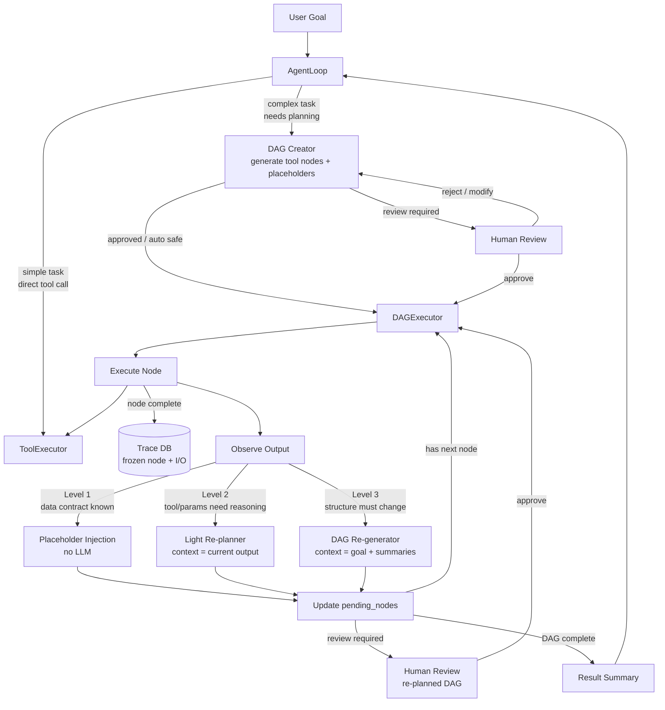

# dagent

> **Plan. Observe. Re-plan. Execute.**

**dagent** is a *Dynamic DAG Agent* framework. Given a goal, it generates an executable
DAG, runs it node by node, and incrementally re-plans the remaining graph as each node's
output reveals new information — without restarting, without bloating context.

Traditional agent frameworks choose one of two extremes: a free-running ReAct loop with
no structure, or a rigid static pipeline with no adaptability. dagent rejects both. Every
task gets a reviewable, auditable plan up front. That plan evolves as execution proceeds —
only the parts that need changing are changed, and everything already executed is frozen
and immutable.

> **Design origin:** The self-planning dynamic DAG agent loop — tool-node DAG with
> three-level incremental re-planning, frozen Trace DB as the context boundary, and
> automatic DAG-vs-AgentLoop task routing — was conceived and first implemented by the
> author of this repository. First committed: **2026-05-01**.

---

## Core Ideas

**1. Self-planning DAG, not a static pipeline.**
The agent generates the initial DAG from the goal. After each node executes, it observes
the output and decides whether to inject values, re-reason locally, or re-generate the
downstream subgraph. The plan is always the latest best understanding of how to reach
the goal.

**2. Tool nodes, not agent nodes.**
Every DAG node is a deterministic tool call. Intelligence lives in the re-planner between
nodes, not inside them. Nodes are cheap, testable, and auditable.

**3. Three-level re-planning with minimal context.**
After each node completes, the executor picks the lightest strategy that suffices —
from zero-LLM placeholder substitution up to full downstream re-generation. Each level
receives only the context it actually needs.

**4. Frozen trace as the context boundary.**
Completed nodes are immediately written to an immutable Trace DB and dropped from the
active LLM context. The re-planner reads goal-aligned summaries, never raw history.
Context stays bounded regardless of task length.

**5. Human review as a first-class checkpoint.**
Medium/high-risk DAGs require explicit approval before execution. Re-planned DAGs can
trigger a second review. The human is never bypassed.

---

## Architecture

### Dynamic DAG Agent Loop



### Three-Level Re-planning

After every node completes, the DAGExecutor selects the minimum re-planning strategy:

| Level | Trigger | Context passed to LLM | Cost |
|-------|---------|----------------------|------|
| **1 — Placeholder Injection** | Data contract defined at creation; only values unknown | Predecessor output → direct substitution | No LLM call |
| **2 — Light Re-planner** | Next node's tool or params require runtime reasoning | Current node output + next node definition | Lightweight |
| **3 — DAG Re-generator** | Downstream structure must change | Original goal + per-node result summaries | Full re-plan |

Design principles:

- **Minimal context by design.** Each level receives only what it needs. Completed nodes
  live in Trace DB and are never re-injected into LLM context.
- **Incremental re-planning.** Level 3 re-generates only the pending subgraph.
  Completed nodes are preserved as-is.
- **Frozen nodes are immutable.** Once written to Trace DB, a node's record cannot be
  modified. Audit integrity is guaranteed.

### When to Use DAG vs. Direct Tool Calls

| Task shape | Path |
|------------|------|
| Subtasks that can run in parallel | DAG |
| Sequential steps with known structure, runtime values only | DAG + placeholder injection |
| Exploratory — next action depends on observation | Direct AgentLoop tool calls |
| Dynamic fan-out — node count unknown until runtime | Direct AgentLoop tool calls |

Forcing exploratory tasks into a DAG produces worse results than leaving them as
sequential tool calls. The DAG Creator is responsible for this routing judgment.

### Trace DB

Every completed node is written immediately on completion:

```
{ node_id, tool, params, output, summary, timestamp, status }
```

Trace DB serves three purposes:

1. **Audit log** — immutable record of what ran, with what inputs, and what it returned.
2. **Re-planning source** — Level 3 re-planner reads summaries, not raw outputs, keeping
   context bounded regardless of how many nodes have executed.
3. **Human review** — the WebUI surfaces the trace timeline alongside the DAG graph.

---

## Safety Model

The runtime is intentionally layered:

- DAG Creator proposes a DAG but does not grant permissions.
- `DAGExecutor` validates the DAG, applies hard risk overrides, and blocks medium/high
  risk DAGs until explicitly approved.
- Each node is a bounded tool call — no nested agent loop inside a node.
- `ToolExecutor` enforces boundaries before every tool call.
- Human review can be triggered at initial DAG creation and after any Level 3 re-plan.

Boundary checks:

- `read_only` nodes cannot write files
- `allowed_paths` prevents path traversal and absolute path escape
- `forbidden_tools` blocks specific tools
- unregistered tools fail closed

---

## Project Layout

```text
dagent/
  api/              FastAPI app — task, DAG, run, and trace endpoints
  harness_runtime/  AgentLoop, DAGExecutor, re-planner, trace recorder, dag_creator tool
  providers/        OpenAI-compatible and mock chat providers
  schemas/          DAG, node, edge, trace, feedback models
  tools/            tool registry, executor, file tools, boundary checks
  state/            prompt assembly and context management
profiles/           editable agent profiles (dag_creator, dag_reviewer, feedback_learner)
tests/              pytest suite
```

## Configuration

```yaml
provider:
  base_url: "https://api.minimaxi.com/v1"
  model: "MiniMax-M2.1"
  api_key_env: "MINIMAX_API_KEY"
  timeout_seconds: 60
profiles:
  directory: "profiles"
  dag_creator: "dag_creator"
  dag_reviewer: "dag_reviewer"
  feedback_learner: "feedback_learner"
```

Secrets in `.env` (git-ignored):

```env
MINIMAX_API_KEY=your-api-key
```

Override config path:

```powershell
$env:DAGENT_CONFIG="C:\path\to\config.yaml"
```

## Agent Profiles

Each role (DAG creator, reviewer, feedback learner) has an editable profile directory:

```text
profiles/
  dag_creator/      soul.md  guideline.md  agent.md  memory.md  profile.yaml
  dag_reviewer/     soul.md  guideline.md  agent.md  memory.md  profile.yaml
  feedback_learner/ soul.md  guideline.md  agent.md  memory.md  profile.yaml
```

`profile.yaml` defines ordered prompt layers. Dynamic content (tools, task context,
trace data) is injected at runtime and never stored in profile files.

---

## Development

```powershell
uv run --extra dev pytest          # 42 passed, 2 skipped (MockProvider)
```

Real provider integration tests:

```powershell
$env:DAGENT_RUN_MINIMAX_TESTS="1"
uv run --extra dev pytest tests/test_minimax_integration.py
```

Run API + frontend:

```powershell
uv run uvicorn dagent.api.app:app --host 127.0.0.1 --port 8001

cd web && npm install && npm run dev
```

## Quick Start

Verify provider connection:

```python
import asyncio
from dagent.config import load_config
from dagent.providers import OpenAICompatibleProvider

async def main():
    config = load_config()
    provider = OpenAICompatibleProvider(config.provider)
    response = await provider.chat([{"role": "user", "content": "Reply with exactly: OK"}])
    print(response.content)

asyncio.run(main())
```

Run the full dynamic DAG agent loop:

```python
import asyncio
from dagent.factory import create_control_plane

async def main():
    cp = create_control_plane(workspace_root=".")
    record = await cp.create_task(
        "Read README and summarize the implemented milestones.",
        task_id="demo_task",
    )
    if record.dag.status == "review_required":
        cp.approve_dag(record.task_id)

    result = await cp.execute_task(record.task_id)
    print("completed:", result.completed)
    for node_id, node_result in result.node_results.items():
        print(node_id, node_result.final_response)

asyncio.run(main())
```
