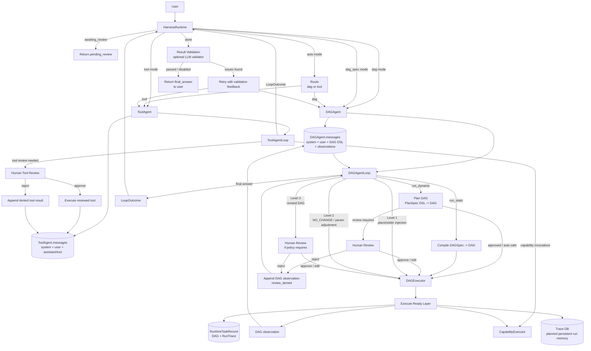

# dagent

> **Plan globally. Re-plan locally.**

**dagent** is a *Dynamic DAG Agent* framework. It can run a request through a
bounded tool-using agent, or through a planner that creates and executes a
reviewable capability-node DAG. The runtime keeps those modes separate: each
agent owns its own message thread, while the harness stores structured task,
review, and execution state.

Traditional agent frameworks choose one of two extremes: a free-running ReAct loop with
no structure, or a rigid static pipeline with no adaptability. dagent rejects both. Every
task that needs orchestration gets a reviewable, auditable plan up front. That plan
can evolve from DAG observations as execution proceeds, while completed tool results
remain structured execution records.

> **Design origin:** The self-planning dynamic DAG agent loop - capability-node DAG with
> three-level incremental re-planning, Trace DB as the long-term context boundary,
> human review checkpoints, DAG-vs-tool task routing, and resumable execution - was
> conceived and first implemented by the author of this repository. First committed:
> **2026-05-01**.

---

## Core Ideas

**1. Self-planning DAG, not a static pipeline.**
The DAG agent generates an initial capability-node plan from the goal. After each
executable layer, the planner receives a DAG observation and can return `NO_CHANGE`,
a revised DAG, or the final answer.

**2. Typed DAG nodes, direct capability payloads.**
Every DAG node has a typed `payload`. Capability payloads wrap a
`CapabilityInvocation` executed by `CapabilityExecutor`; start nodes are explicit
payloads and do not carry fake invocations. The dynamic DAG planner currently emits
direct, non-agent capability calls from enabled toolsets; `DAGSpec` runtime can execute
agent capabilities, but the planner does not generate agent nodes yet.

**3. Three-level re-planning.**
The current implementation covers three levels in one execution path: placeholder
injection before a tool call, `NO_CHANGE`/parameter-level continuation after an
observation, and DAG revision when the pending graph must change.

**4. Agent-owned message threads.**
`ToolAgent` and `DAGAgent` each own one persistent message thread for the session.
The runtime does not merge global conversation history or inject prior task context.
A follow-up such as "continue" is just the next user message in the active agent's
thread.

**5. Structured task state, not transcript state.**
DAG tasks store the current DAG, node results, execution records, runs, and pending
review state. They do not store planner messages. Tool tasks similarly derive audit
records from tool messages without owning the agent transcript.

**6. Human review as a first-class checkpoint.**
Medium/high-risk DAGs require explicit approval before execution. Re-planned DAGs can
trigger a second review. The human is never bypassed.

---

## Architecture

### Harness Runtime


```mermaid
flowchart TD
  U["User"] --> R["HarnessRuntime"]
  R -->|"auto mode"| ROUTE["Route\ndag or tool"]
  R -->|"tool mode"| TA["ToolAgent"]
  R -->|"dag mode"| DA["DAGAgent"]
  R -->|"dag_spec mode"| DA

  ROUTE -->|"tool"| TA
  ROUTE -->|"dag"| DA

  TA --> TM[("ToolAgent.messages\nsystem + user + assistant/tool")]
  TA --> TAL["ToolAgentLoop"]
  TAL -->|"capability invocations"| T["CapabilityExecutor"]
  TAL -->|"tool review needed"| TRV["Human Tool Review"]
  TRV -->|"approve"| TEX["Execute reviewed tool"]
  TRV -->|"reject"| TDENY["Append denied tool result"]
  TEX --> TM
  TDENY --> TM
  TAL -->|"LoopOutcome"| R

  DA --> DM[("DAGAgent.messages\nsystem + user + DAG DSL + observations")]
  DA --> DAL["DAGAgentLoop"]
  DAL -->|"run_dynamic"| D["Plan DAG\nPlanSpec DSL -> DAG"]
  DAL -->|"run_static"| SD["Compile DAGSpec -> DAG"]

  D -->|"review required"| UI["Human Review"]
  D -->|"approved / auto safe"| E["DAGExecutor"]
  SD --> E
  UI -->|"approve / edit"| E
  UI -->|"reject"| DENY["Append DAG observation:\nreview_denied"]
  DENY --> DAL

  E --> N["Execute Ready Layer"]
  N --> T
  N --> ER[("RuntimeTaskRecord\nDAG + RunTrace")]
  N --> TR[("Trace DB\nplanned persistent run memory")]
  N --> OBS["DAG observation"]
  OBS --> DM
  DM --> DAL
  DAL -->|"Level 1\nplaceholder injection"| E
  DAL -->|"Level 2\nNO_CHANGE / param adjustment"| E
  DAL -->|"Level 3\nrevised DAG"| UI2["Human Review\nif policy requires"]
  UI2 -->|"approve / edit"| E
  UI2 -->|"reject"| DENY
  DAL -->|"final answer"| DR["LoopOutcome"]
  DR --> R

  R -->|"awaiting_review"| UIWAIT["Return pending_review"]
  R -->|"done"| V["Result Validation\noptional LLM validator"]
  V -->|"issues found"| RTRY["Retry with validation feedback"]
  RTRY --> TA
  RTRY --> DA
  V -->|"passed / disabled"| O["Return final_answer\nto user"]
```

`HarnessRuntime` is the top-level control layer. It owns routing, session task state,
review continuation lookup, optional result validation, retry feedback, and final result
delivery. It does not own the model transcript.

`ToolAgent` owns the tool-agent system prompt and persistent tool-call message thread,
then delegates bounded execution to `ToolAgentLoop`. Tool review approval replaces the
pending tool marker with the real tool result; rejection replaces it with a denied tool
result and lets the loop continue.

`DAGAgent` owns the DAG planner system prompt and persistent DAG message thread, then
delegates DAG work to `DAGAgentLoop`. Dynamic DAG requests enter through `run_dynamic(...)`;
fixed `DAGSpec` requests enter through `run_static(...)`. Both share `execute(record, ...)`,
which drives `DAGExecutor` layer execution. `RuntimeTaskRecord` stores structured resume
state only: DAG, the latest `RunTrace`, and pending review. It does not store
`dag_messages`.

Once review and validation pass, the runtime returns the loop's `final_answer` directly
without a separate summarization step.

### Three-Level Re-planning

After each ready layer executes, `DAGAgentLoop` formats a DAG observation and appends it
to `DAGAgent.messages`. The observation includes each recent node's id, capability
function, arguments, status, and result/error content so the planner does not need to
recover execution facts from transcript history. Re-planning is implemented as three
levels:

| Level | Current implementation | Meaning |
|-------|------------------------|---------|
| **1 - Placeholder injection** | `DAGExecutor` resolves `{{node.output}}`-style placeholders from completed node results before each tool call. | Runtime values flow into downstream tool arguments without an LLM call. |
| **2 - Local continuation / parameter reasoning** | The DAG LLM receives the latest observation and can return `NO_CHANGE` or a revised PlanSpec with changed arguments. | Keep the current DAG structure, or adjust pending node parameters based on observed results. |
| **3 - DAG revision** | The DAG LLM returns a revised PlanSpec DSL; `_apply_replan()` invalidates changed/deleted nodes and downstream results, then review policy decides whether to pause. | Change pending graph structure when the original plan no longer fits. |

In concrete response terms, the DAG LLM can return:

| Response | Meaning |
|----------|---------|
| `NO_CHANGE` | Continue executing the current DAG. |
| PlanSpec DSL | Replace or revise pending DAG work, subject to review policy. |
| Natural-language answer | Finish the task and return `final_answer`. |

The executor also resolves placeholders from completed node outputs before a tool call.
Unresolved placeholders fail closed before execution. `DAGSpec` artifacts are declared
once on the spec, then referenced by node `inputs` and `outputs`; output artifacts may
only have one producer, and consumers of produced artifacts must depend on the producer
through explicit DAG edges. Capability arguments and boundary paths can reference
artifact paths with `{{artifact.<id>.path}}`.

### When to Use DAG vs. Tool Mode

| Task shape | Path |
|------------|------|
| Subtasks that can run in parallel | DAG |
| Sequential steps with known structure, runtime values only | DAG |
| Exploratory - next action depends on observation | `ToolAgent` |
| Dynamic fan-out - node count unknown until runtime | `ToolAgent` |

Forcing exploratory tasks into a DAG produces worse results than leaving them as
sequential tool calls. In `auto` mode, `HarnessRuntime` makes this routing judgment
before dispatching to `ToolAgent` or `DAGAgent`.

### Run Trace

Runtime execution is represented as one `RunTrace` tree. The root is the run; DAG work
is represented by `dag_node` children; leaf capability calls are `capability_call`
nodes with `{ invocation, result }`. Agent capabilities attach their inner loop as
children, so DAG, agent, tool, skill, and MCP execution share the same shape.

Current implementation:

- `DAGExecutor.execute_next_ready_layer()` returns a cumulative `RunTrace`.
- `ToolAgentLoop` and `AgentCapabilityProvider` also return `RunTrace`.
- `DAGRun`, `LoopOutcome`, and `RuntimeResponse` expose `trace`; artifact state lives at
  `trace.artifacts`.
- The API and Web UI surface trace snapshots during the current process lifetime.

Target architecture:

- Persist run traces and compact result summaries into a Trace DB.
- Use Trace DB as the long-term audit store and context boundary for future replanning,
  instead of relying only on in-memory task state.

Trace DB / execution records serve three purposes:

1. **Audit log** - immutable record of what ran, with what inputs, and what it returned.
2. **DAG observation source** - DAG observations include completed node outputs and recent
   capability leaves so the planner can continue or repair the DAG.
3. **Human review** - the WebUI surfaces the trace timeline alongside the DAG graph.

---

## Safety Model

The runtime is intentionally layered:

- `HarnessRuntime` routes requests, manages runtime session state, applies human
  review gates, optionally validates final results, and returns the loop's final answer.
- DAG Agent proposes a DAG but does not grant permissions.
- `DAGExecutor` validates the DAG, applies hard risk overrides, and blocks medium/high
  risk DAGs until explicitly approved.
- Each capability node is a bounded invocation - no nested agent loop inside a node unless an agent capability is explicitly configured.
- `CapabilityExecutor` dispatches approved invocations, and capability handlers enforce boundaries before side effects.
- Human review can be triggered by tool-mode capability calls, initial DAG creation, and DAG
  revisions.
- Optional result validation uses a separate `validator_agent` profile to check the
  final answer against the original user request and execution context. If validation
  finds issues, the runtime retries once with validator feedback.
- Validation receives a bounded evidence view of tool/node execution results: each
  result excerpt is capped, the full validation context has an overall budget, and
  truncated evidence is explicitly marked.

Boundary checks:

- `read_only` nodes cannot write files
- `allowed_paths` prevents path traversal and absolute path escape
- `forbidden_tools` blocks specific tools
- unregistered tools fail closed

---

## Project Layout

```text
dagent/
  api/              FastAPI app - task, DAG, run, and trace endpoints
  harness_runtime/  runtime orchestration, ToolAgent, ToolAgentLoop, DAGAgent,
                    DAGAgentLoop, validation,
                    session state, event adapters, DAG execution
  providers/        OpenAI-compatible and mock chat providers
  schemas/          DAG, node, edge, trace, feedback, result/outcome contracts
  tools/            tool registry, executor, file tools, boundary checks
  state/            prompt assembly
profiles/           editable agent profiles (conversation, dag_agent, validator_agent, feedback_learner)
web/                React + Vite frontend
tests/              pytest suite
```

Key runtime contracts such as `RunTrace`, `LoopOutcome`, `RuntimeResponse`,
`PendingReview`, and validation result types live in `dagent/schemas`.
`harness_runtime` owns behavior; `schemas` owns shared data contracts.

## Configuration

```yaml
provider:
  base_url: "https://api.minimaxi.com/v1"
  model: "MiniMax-M2.1"
  api_key_env: "MINIMAX_API_KEY"
  timeout_seconds: 60
  strip_thinking: false
enable_result_validation: false
profiles:
  directory: "profiles"
  conversation: "conversation"
  dag_agent: "dag_agent"
  validator_agent: "validator_agent"
  feedback_learner: "feedback_learner"
```

Secrets in `.env` (git-ignored):

```env
MINIMAX_API_KEY=your-api-key
```

Override config path:

```powershell
$env:DAGENT_CONFIG="C:\path\to\config.yaml"
```

## Agent Profiles

Each role has an editable profile directory:

```text
profiles/
  conversation/       soul.md  guideline.md  agent.md  memory.md  profile.yaml
  dag_agent/          soul.md  guideline.md  agent.md  memory.md  profile.yaml
  validator_agent/    soul.md  guideline.md  agent.md  memory.md  profile.yaml
  feedback_learner/   soul.md  guideline.md  agent.md  memory.md  profile.yaml
```

`profile.yaml` defines ordered prompt layers. Dynamic content such as tools, skills,
memory, and per-request user messages is injected at runtime and never stored in
profile files.

---

## Development

```powershell
uv run --extra dev pytest
```

Real provider integration tests:

```powershell
$env:DAGENT_RUN_MINIMAX_TESTS="1"
uv run --extra dev pytest tests/test_minimax_integration.py
```

Run API + frontend:

```powershell
uv run uvicorn dagent.api.app:app --host 127.0.0.1 --port 8001

cd web && npm install && npm run dev
```

## Quick Start

Verify provider connection:

```python
import asyncio
from dagent.config import load_config
from dagent.providers import OpenAICompatibleProvider

async def main():
    config = load_config()
    provider = OpenAICompatibleProvider(config.provider)
    response = await provider.chat([{"role": "user", "content": "Reply with exactly: OK"}])
    print(response.content)

asyncio.run(main())
```

Run the harness runtime:

```python
import asyncio
from dagent.factory import create_harness_runtime

async def main():
    runtime = create_harness_runtime(workspace_root=".")
    result = await runtime.handle_message(
        "Read README and summarize the implemented milestones.",
        mode="auto",
        review_level="fast",
    )
    print(result.status)
    print(result.final_answer)

asyncio.run(main())
```
