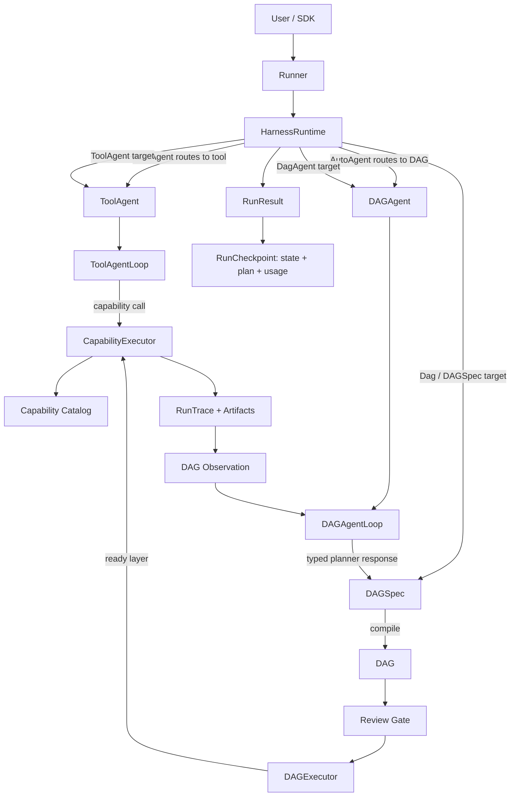

<p align="center">
  
</p>

<p align="center">
  <strong>Plan globally. Re-plan locally.</strong>
</p>

<p align="center">
  <a href="docs/en/README.md"></a>
  <a href="docs/zh-CN/README.md"></a>
  <a href="https://pypi.org/project/dagent-ai/"></a>
  <a href="LICENSE"></a>
</p>

<p align="center">
  <a href="docs/en/README.md">Documentation</a> |
  <a href="docs/zh-CN/README.md">中文文档</a> |
  <a href="https://pypi.org/project/dagent-ai/">PyPI</a> |
  <a href="LICENSE">License</a>
</p>

**dagent** is a Dynamic DAG Agent framework. It can automatically route a
request, run it through a bounded tool-using agent, or use a planner that creates
and executes a reviewable capability-node DAG. Public agent objects are
declarative configuration, while `Runner` owns the runtime session, capability
catalog, review continuations, and execution state.

Traditional agent frameworks choose one of two extremes: a free-running ReAct
loop with no structure, or a rigid static pipeline with no adaptability. dagent
rejects both. Work that needs orchestration gets a reviewable, auditable plan up
front. That plan can evolve from DAG observations as execution proceeds, while
completed tool results remain structured execution records.

> **Design origin:** The self-planning dynamic DAG agent loop - capability-node
> DAG with three-level incremental re-planning, Trace DB as the long-term context
> boundary, human review checkpoints, DAG-vs-tool task routing, and resumable
> execution - was conceived and first implemented by the author of this
> repository. First committed: **2026-05-01**.

---

## Core Ideas

**1. Reviewable plans, not opaque loops.**
Tasks that need orchestration become capability-node DAGs before execution. The
plan is typed, inspectable, and can pause for human review before risky work
runs.

**2. Typed nodes with direct capability calls.**
Every DAG node has a typed `payload`. Capability nodes wrap a
`CapabilityInvocation`; start nodes are explicit and do not carry fake tool
calls. The runtime executes capabilities through a shared `CapabilityExecutor`.

**3. Structured parameter passing between nodes.**
Static DAG arguments can reference graph input, upstream node results, and
artifact paths. These references are structured `$expr` bindings in `DAGSpec`,
resolved immediately before a capability call. A node that reads another node's
output must explicitly depend on it.

**4. Re-planning stays local.**
After each executable DAG layer, the planner receives a DAG observation and can
return a schema-validated `no_change`, a complete typed graph revision, or a
`final_answer`. The host normalizes proposals to canonical `DAGSpec`; completed
node results stay as structured execution records instead of being rediscovered
from chat history.

**5. Runner owns runtime state.**
Public `AutoAgent`, `ToolAgent`, `DagAgent`, and `Dag` objects are declarative
configuration. `Runner` owns the provider, capability catalog, session state,
review continuations, and execution dispatch.

**6. Safety is part of execution, not prompting.**
The DAG planner proposes work, but capability handlers enforce boundaries before
side effects. Medium/high-risk work can require review; disabled or unknown
capabilities fail closed; file boundaries reject path escape.

**7. Portable continuation has an explicit contract.**
`RunCheckpoint` keeps mutable `RunState`, immutable resolved execution semantics,
and shared operation usage separate. Hosts persist the checkpoint and rebuild
providers and capability implementations; the SDK validates and resumes it.

## Quick Start

Install the PyPI package as `dagent-ai`; import it in Python as `dagent`:

```bash
pip install dagent-ai
```

Register a Python tool, configure an OpenAI-compatible provider, and run a
bounded `ToolAgent`:

```python
import asyncio

import dagent


@dagent.tool
def echo(text: str) -> str:
    return f"echo:{text}"


async def main():
    provider = dagent.Provider(
        base_url="https://api.openai.com/v1",
        model="your-model",
        api_key_env="OPENAI_API_KEY",
    )
    runner = dagent.Runner(workspace=".dagent", provider=provider, capabilities=[echo])
    agent = dagent.ToolAgent(profile="conversation", capabilities=["tool.echo"])

    result = await runner.run(
        agent,
        input="Use echo to respond with hello.",
    )
    print(result.output_text)
    runner.close()


asyncio.run(main())
```

For a complete first run, static DAG example, provider configuration, and local
development setup, read the [Quick Start](docs/en/quick-start.md).

Run offline examples from the repository root:

```bash
uv run python -m examples.tool_agent
uv run python -m examples.static_dag
uv run python -m examples.streaming
```

## Architecture


```mermaid
flowchart TD
  U["User / SDK"] --> RUN["Runner"]
  RUN --> HR["HarnessRuntime"]
  HR -->|"AutoAgent routes to tool"| TA["ToolAgent"]
  HR -->|"ToolAgent target"| TA
  HR -->|"AutoAgent routes to DAG"| DA["DAGAgent"]
  HR -->|"DagAgent target"| DA
  HR -->|"Dag / DAGSpec target"| DS["DAGSpec"]

  TA --> TAL["ToolAgentLoop"]
  TAL -->|"capability call"| CE["CapabilityExecutor"]

  DA --> DAL["DAGAgentLoop"]
  DAL -->|"typed planner response"| DS
  DS -->|"compile"| DAG
  DAG --> RG["Review Gate"]
  RG --> DE["DAGExecutor"]
  DE -->|"ready layer"| CE
  CE --> CAT["Capability Catalog"]
  CE --> RT["RunTrace + Artifacts"]
  RT --> OBS["DAG Observation"]
  OBS --> DAL
  HR --> RR["RunResult"]
  RR --> CP["RunCheckpoint: state + plan + usage"]
```

`Runner` is the public SDK entrypoint and owns the configured runtime, session,
and capability catalog. `HarnessRuntime` is the lower-level control layer for
routing, review continuations, optional result validation, and final response
delivery.

`AutoAgent` lets the runtime route each request to direct tool use or dynamic
DAG planning. `ToolAgent` delegates bounded tool-loop work to `ToolAgentLoop`.
`DagAgent` delegates dynamic planning and fixed `DAGSpec` execution to
`DAGAgentLoop`. Both paths share `CapabilityExecutor`, so Python tools, MCP
tools, skill accessors, shell commands, file tools, memory, and agent
capabilities go through the same catalog and boundary enforcement.

`DAGExecutor` validates graph structure, resolves structured value expressions,
executes ready layers, updates artifact state, and returns a cumulative
`RunTrace`.

---

## Project Layout

```text
api/               local FastAPI backend for the WebUI
dagent/
  capabilities/     capability catalog, providers, adapters, and built-in handlers
  harness_runtime/  runtime orchestration, agent loops, validation, session state,
                    event adapters, DAG execution
  providers/        OpenAI-compatible and mock chat providers
  resources/        packaged default Markdown profiles
  schemas/          DAG, node, edge, trace, feedback, result/outcome contracts
  state/            prompt assembly
docs/              user-facing documentation
examples/          runnable SDK examples
web/               React + Vite frontend
tests/             pytest suite
```

Key runtime contracts such as `RunState`, `RunTrace`, `LoopOutcome`,
`PendingReview`, and validation result types live in `dagent/schemas`.
`harness_runtime` owns behavior; `schemas` owns shared data contracts.

## Documentation

- [Documentation portal](docs/README.md)
- [English documentation](docs/en/README.md)
- [中文文档](docs/zh-CN/README.md)
- [Runnable examples](examples/README.md)

## License

Apache License 2.0. See [LICENSE](LICENSE).
