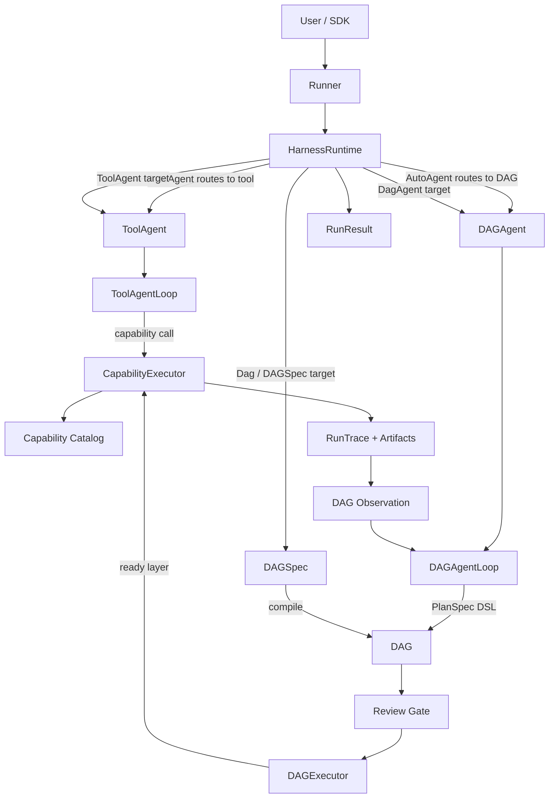

# dagent

> **Plan globally. Re-plan locally.**

**dagent** is a *Dynamic DAG Agent* framework. It can automatically route a
request, run it through a bounded tool-using agent, or use a planner that creates
and executes a reviewable capability-node DAG. Each public agent object is
declarative configuration, while `Runner` owns the runtime session, capability
catalog, review continuations, and execution state.

Traditional agent frameworks choose one of two extremes: a free-running ReAct loop with
no structure, or a rigid static pipeline with no adaptability. dagent rejects both. Every
task that needs orchestration gets a reviewable, auditable plan up front. That plan
can evolve from DAG observations as execution proceeds, while completed tool results
remain structured execution records.

> **Design origin:** The self-planning dynamic DAG agent loop - capability-node DAG with
> three-level incremental re-planning, Trace DB as the long-term context boundary,
> human review checkpoints, DAG-vs-tool task routing, and resumable execution - was
> conceived and first implemented by the author of this repository. First committed:
> **2026-05-01**.

---

## Core Ideas

**1. Reviewable plans, not opaque loops.**
Tasks that need orchestration become capability-node DAGs before execution. The
plan is typed, inspectable, and can pause for human review before risky work runs.

**2. Typed nodes with direct capability calls.**
Every DAG node has a typed `payload`. Capability nodes wrap a
`CapabilityInvocation`; start nodes are explicit and do not carry fake tool
calls. The runtime executes capabilities through a shared `CapabilityExecutor`.

**3. Structured parameter passing between nodes.**
Static DAG arguments can reference graph input, upstream node results, and
artifact paths. These references are structured `$expr` bindings in `DAGSpec`,
resolved immediately before a capability call. A node that reads another node's
output must explicitly depend on it.

**4. Re-planning stays local.**
After each executable DAG layer, the planner receives a DAG observation and can
return `NO_CHANGE`, a revised PlanSpec, or a final answer. Completed node results
stay as structured execution records instead of being rediscovered from chat
history.

**5. Runner owns runtime state.**
Public `AutoAgent`, `ToolAgent`, `DagAgent`, and `Dag` objects are declarative
configuration. `Runner` owns the provider, capability catalog, session state,
review continuations, and execution dispatch.

**6. Safety is part of execution, not prompting.**
The DAG planner proposes work, but capability handlers enforce boundaries before
side effects. Medium/high-risk work can require review; disabled or unknown
capabilities fail closed; file boundaries reject path escape.

## Quick Start

Pass SDK configuration explicitly to the runner:

```python
import dagent


@dagent.tool
def search(q: str) -> str:
    return f"found:{q}"


provider = dagent.Provider(
    base_url="https://api.openai.com/v1",
    model="your-model",
    api_key_env="OPENAI_API_KEY",
)

runner = dagent.Runner(
    workspace=".",
    provider=provider,
    capabilities=[search],
    mcp_servers={
        "fs": {
            "command": "npx",
            "args": ["-y", "@modelcontextprotocol/server-filesystem", "."],
        },
    },
    skill_roots=["team-skills"],
    profile_root="profiles",
)
```

Use `Runner.from_config(...)` when provider settings, MCP servers, validation,
or profile directories should come from a config file:

```python
runner = dagent.Runner.from_config("config.yaml", workspace=".", capabilities=[search])
```

The same capability types can be added after runner construction:

```python
@dagent.tool
def summarize(text: str) -> str:
    return text.split(".")[0]


runner = dagent.Runner(provider=provider, workspace=".")
runner.add_tool(summarize)
runner.add_mcp_server(
    "fs",
    {
        "command": "npx",
        "args": ["-y", "@modelcontextprotocol/server-filesystem", "."],
    },
)
runner.add_skill_root("more-skills")
runner.skill_store.install(
    "Keep every answer compact.",
    name="terse",
    description="Compact response style.",
    category="writing",
)
```

Runtime MCP registrations can be replaced or removed without touching agent
configuration:

```python
runner.replace_mcp_server(
    "fs",
    {
        "command": "npx",
        "args": ["-y", "@modelcontextprotocol/server-filesystem", "docs"],
    },
)
runner.remove_mcp_server("fs")
```

Python tools are exposed as `tool.<name>` capabilities. MCP stdio server tools
are exposed as `mcp.<server>.<tool>` and require the MCP optional extra. Skill
roots are available through the built-in `skill.list` and `skill.view`
capabilities. Agents use `skills=[...]` to limit which concrete skills those
accessors can see.

Built-in profiles are packaged resources. Use them by name on agents, or read
them directly when you need to inspect the prompt:

```python
agent = dagent.ToolAgent(profile="conversation")
profile = dagent.load_builtin_profile("conversation")
available = dagent.list_builtin_profiles()
```

Run an `AutoAgent` when the runtime should choose direct tool use or a dynamic
DAG per request:

```python
import asyncio

import dagent


@dagent.tool
def search(q: str) -> str:
    return f"found:{q}"


async def main():
    runner = dagent.Runner(provider=provider, workspace=".", capabilities=[search])
    agent = dagent.AutoAgent(capabilities=["tool.search"], skills=["writing/terse"])

    result = await runner.run(agent, "Answer directly or plan if orchestration helps.")
    print(result.kind)
    print(result.output_text)


asyncio.run(main())
```

Run a `ToolAgent` for bounded tool-loop work:

```python
import asyncio

import dagent


@dagent.tool
def echo(text: str) -> str:
    return f"echo:{text}"


async def main():
    runner = dagent.Runner(provider=provider, workspace=".", capabilities=[echo])
    agent = dagent.ToolAgent(
        profile="conversation",
        capabilities=["tool.echo"],
        skills=["writing/terse"],
    )

    result = await runner.run(agent, "Use echo to respond with hello.")
    print(result.output_text)
    print(result.model_dump(mode="json"))


asyncio.run(main())
```

Run a `DagAgent` when the model should plan a reviewable DAG:

```python
import asyncio

import dagent


@dagent.tool
def search(q: str) -> str:
    return f"found:{q}"


async def main():
    runner = dagent.Runner(provider=provider, workspace=".", capabilities=[search])
    agent = dagent.DagAgent(capabilities=["tool.search"], review="careful")

    result = await runner.run(agent, "Research dagent and write a short note.")
    if result.requires_review and result.review is not None:
        result = await runner.resume(result.review.approve())

    print(result.output_text)


asyncio.run(main())
```

Build a static `Dag` when the graph shape belongs in code:

```python
import asyncio

from pydantic import BaseModel

import dagent


class ResearchInput(BaseModel):
    query: str
    audience: str = "engineers"


class SearchResult(BaseModel):
    title: str
    url: str


@dagent.tool
def search(q: str) -> SearchResult:
    return SearchResult(title=f"found:{q}", url="https://example.test")


@dagent.tool
def render(title: str, url: str, audience: str) -> str:
    return f"{title} for {audience}: {url}"


async def main():
    dag = dagent.Dag("research", input=ResearchInput)
    found = dagent.Node("search", target=search, inputs={"q": dag.input.query})
    rendered = dagent.Node(
        "render",
        target=render,
        inputs={
            "title": found.output.title,
            "url": found.output.url,
            "audience": dag.input.audience,
        },
    )
    dag.add_node(found)
    dag.add_node(rendered)
    dag.add_edge(found, rendered)

    dagent.validate_dag_spec(dag.to_dag_spec())

    runner = dagent.Runner(provider=provider, workspace=".")
    result = await runner.run(dag, input=ResearchInput(query="dagent"))
    print(result.status)
    print(result.node_output("render"))


asyncio.run(main())
```

`Runner.run(...)` always returns `RunResult`, including static `Dag` and
`DAGSpec` runs. Customize static DAGs with Pydantic graph inputs, typed tool
return values, explicit `.after(...)` dependencies, artifact references, and
per-node boundaries. See the [Python SDK guide](docs/python-sdk.md) for the full
SDK.

Run examples:

```bash
uv run python -m examples.tool_agent
uv run python -m examples.auto_agent
uv run python -m examples.dynamic_dag_agent
uv run python -m examples.static_dag
uv run python -m examples.streaming
uv run python -m examples.runtime_registration_and_skills
```

Run the test suite:

```bash
uv run --extra dev pytest
```

Detailed SDK docs live in the [Python SDK guide](docs/python-sdk.md).

---

## Architecture


```mermaid
flowchart TD
  U["User / SDK"] --> RUN["Runner"]
  RUN --> HR["HarnessRuntime"]
  HR -->|"AutoAgent routes to tool"| TA["ToolAgent"]
  HR -->|"ToolAgent target"| TA
  HR -->|"AutoAgent routes to DAG"| DA["DAGAgent"]
  HR -->|"DagAgent target"| DA
  HR -->|"Dag / DAGSpec target"| DS["DAGSpec"]

  TA --> TAL["ToolAgentLoop"]
  TAL -->|"capability call"| CE["CapabilityExecutor"]

  DA --> DAL["DAGAgentLoop"]
  DAL -->|"PlanSpec DSL"| DAG["DAG"]
  DS -->|"compile"| DAG
  DAG --> RG["Review Gate"]
  RG --> DE["DAGExecutor"]
  DE -->|"ready layer"| CE
  CE --> CAT["Capability Catalog"]
  CE --> RT["RunTrace + Artifacts"]
  RT --> OBS["DAG Observation"]
  OBS --> DAL
  HR --> RR["RunResult"]
```

`Runner` is the public SDK entrypoint and owns the configured runtime, session,
and capability catalog. `HarnessRuntime` is the lower-level control layer for
routing, review continuations, optional result validation, and final response
delivery.

`AutoAgent` lets the runtime route each request to direct tool use or dynamic
DAG planning. `ToolAgent` delegates bounded tool-loop work to `ToolAgentLoop`.
`DAGAgent` delegates dynamic planning and fixed `DAGSpec` execution to
`DAGAgentLoop`. Both paths share `CapabilityExecutor`, so Python tools, MCP
tools, skill accessors, shell commands, file tools, memory, and agent
capabilities go through the same catalog and boundary enforcement.

`DAGExecutor` validates graph structure, resolves structured value expressions,
executes ready layers, updates artifact state, and returns a cumulative
`RunTrace`.

---

## Project Layout

```text
api/               local FastAPI backend for the WebUI
dagent/
  capabilities/     capability catalog, providers, adapters, and built-in handlers
  harness_runtime/  runtime orchestration, agent loops, validation, session state,
                    event adapters, DAG execution
  providers/        OpenAI-compatible and mock chat providers
  resources/        packaged default Markdown profiles
  schemas/          DAG, node, edge, trace, feedback, result/outcome contracts
  state/            prompt assembly
web/                React + Vite frontend
tests/              pytest suite
```

Key runtime contracts such as `RunTrace`, `LoopOutcome`, `RuntimeResponse`,
`PendingReview`, and validation result types live in `dagent/schemas`.
`harness_runtime` owns behavior; `schemas` owns shared data contracts.

## Documentation

- [Python SDK guide](docs/python-sdk.md)
- [Runnable examples](examples/README.md)
